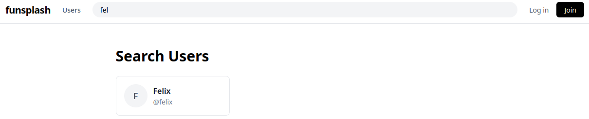

#+title: funsplash documentation
#+author: Felix Dumbeck
#+BIND: org-export-allow-bind t
#+BIND: org-latex-minted-langs ((gleam-ts "gleam") (erlang-ts "erlang") (bash "bash") (diff "diff"))
#+LATEX_HEADER: \usepackage{minted}
#+LATEX_HEADER: \usemintedstyle{friendly}
#+LATEX_HEADER: \setminted{fontsize=\small,frame=lines,breaklines=true}
#+LATEX_HEADER: \usepackage[export]{adjustbox}
#+LATEX_HEADER: \let\oldincludegraphics\includegraphics
#+LATEX_HEADER: \renewcommand{\includegraphics}[2][]{\oldincludegraphics[#1,max height=0.5\textheight,max width=0.9\linewidth,keepaspectratio]{#2}}
#+LATEX_HEADER: \DeclareUnicodeCharacter{251C}{\mbox{|--}}
#+LATEX_HEADER: \DeclareUnicodeCharacter{2500}{-}
#+LATEX_HEADER: \DeclareUnicodeCharacter{2502}{|}
#+LATEX_HEADER: \DeclareUnicodeCharacter{2514}{\mbox{`--}}
#+LATEX_HEADER: \DeclareUnicodeCharacter{00A0}{~}

=Funsplash= is a clone of the image-sharing platform [[https://unsplash.com/][Unsplash]] and is meant to replicate the overall feel as well as its core features.
The entire application is written in the [[https://gleam.run/][Gleam programming language]] with some =ffi= to JavaScript and Erlang. All data storage happens in a PostgreSQL database and photo files are stored on the filesystem.

# TODO: maybe insert links here?

+ Frontend: Gleam with the =lustre= framework, compiled to JavaScript
+ Backend: Gleam with the =wisp= web framework
+ Censoring: Using pure Erlang functions called from Gleam.
+ Storage: PostgreSQL database with bindings generated by =squirrel=. Filesystem for storing photo data using =simplefile=.
+ WebSockets: Uses =mist= for the WebSocket censor endpoint.

All code is available to players during the CTF.

* Installation

As with all Enowars services, the checker and service are run as separate instances.

** Service

On the initial build, =TailwindCSS= and =bun= are downloaded, which might prolong the build time depending on your internet connection.

The required Docker images are =postgres:18-alpine= and =gleam:1.17.0-erlang-alpine=.

#+begin_src bash
  git clone https://github.com/enowars/enowars10-service-funsplash.git
  cd enowars10-service-funsplash/service
  docker compose up --build -d
#+end_src

** Checker

The only unusual thing about the checker is that it runs Python version 3.14 with uv rather than the template-provided setup. Because of this, Mongo v7 cannot be used and v8 must be used instead.

#+begin_src bash
  git clone https://github.com/enowars/enowars10-service-funsplash.git
  cd enowars10-service-funsplash/checker
  docker compose up --build -d
#+end_src

* Usage

The server runs an HTTP web server on port =1337= and the checker uses port =11337=.

It uses a traditional REST API. All API HTTP calls go to =/napi...=.

** Browsing the site

An unauthenticated user has permissions to search for other users, view their profiles, and view their photos.

#+caption: Fuzzy searching a user named =feli= returns the existing user =felix=

** Creating an Account

To create an account, click =Join= and fill out the registration form. Click =Login= to log in with a username and password.

#+caption: Account creation view
[[file:images/Usage/2026-08-14_23-28-07_Screenshot_20260814_232735.png]]

[[file:images/Usage/2026-08-14_23-29-22_Screenshot_20260814_232914.png]]

The only mandatory fields are =Username=, =First Name=, and =Password= (the same as unsplash.com). The other fields are inconsequential.

Upon creating an account, users are automatically logged in.

** Uploading a photo

When logged in, users can upload photos with metadata.

#+caption: Privacy level dropdown. =Private=, =Premium=, and =Public=.
[[file:images/Usage/2026-08-14_23-59-20_Screenshot_20260814_235907.png]]

[[file:images/Usage/2026-08-14_23-59-34_Screenshot_20260814_235925.png]]

** Photo privacy

Photos have three levels of privacy:
+ =private=, where the photo will only be displayed to the owner
+ =public=, for photos visible to everyone
+ =premium=, visible only by the owner themselves and premium users (which don't exist). This privacy level only affects the actual photo; metadata, such as the description, is not affected.

If the option =show on profile= is set, photos (although possibly censored) will appear on the user's profile, with their metadata visible to all. If not, photos will only be visible on the profile page to the owner, but remain visible (censored according to their privacy level) via their public link.

#+caption: The view of an authenticated user on their own profile.
[[file:images/Usage/2026-08-15_00-35-14_Screenshot_20260815_003459.png]]

#+caption: The view of an unauthenticated user on the very same profile.
[[file:images/Usage/2026-08-14_23-20-00_screenshot.png]]

The premium photo will get censored on the server with a large black cross in the middle after the upload in a separate directory next to the uncensored photos.

The premium censor mask only works on PNGs. For other images a broken icon will appear instead.

** Censoring

The same functionality used for the premium censor is also available to users to censor images by drawing on them.
Any user can join the collaborative photo censoring.

Censoring is done live on the server; communication consisting of the censor mask and the reply (whether the update succeeded) occurs over a WebSocket. The decision to allow censoring is dependent on whether the newly updated photo would exceed the storage quota of the photo's owner.
Once the WebSocket is closed, the image is saved (if the storage quota is not violated) with the same settings/metadata as the original on the original creator's profile. Only the string =(censored)= is appended to the description.

#+caption: Screenshot showing the censoring of a photo over a WebSocket.
[[file:images/Usage/2026-08-15_01-41-56_Screenshot_20260815_014119.png]]

Again, only PNGs are supported!

** Editing profiles and photos

Users can also edit their profile information and photo metadata:

#+DOWNLOADED: file:///tmp/Spectacle.IclxWT/Screenshot_20260815_014403.png @ 2026-08-15 01:44:16
[[file:images/Usage/2026-08-15_01-44-16_Screenshot_20260815_014403.png]]

#+DOWNLOADED: file:///tmp/Spectacle.ipXUxs/Screenshot_20260815_014510.png @ 2026-08-15 01:45:18
[[file:images/Usage/2026-08-15_01-45-18_Screenshot_20260815_014510.png]]

** Collections and likes

Photos can be aggregated in multiple collections.

#+DOWNLOADED: file:///tmp/Spectacle.ipXUxs/Screenshot_20260815_015002.png @ 2026-08-15 01:50:13
[[file:images/Usage/2026-08-15_01-50-13_Screenshot_20260815_015002.png]]

Collections can also be 'private'. This is the equivalent of the =show on profile= setting for photos.

[[file:images/Usage/2026-08-15_01-50-35_Screenshot_20260815_015030.png]]

To show a user's collections, click =Collections= on the user's profile:

[[file:images/Usage/2026-08-15_01-55-24_Screenshot_20260815_015433-1.png]]

Users' likes are recorded as well.

[[file:images/Usage/2026-08-15_01-58-42_Screenshot_20260815_015808-1.png]]

** Cleanup

Every 100 seconds, a POSIX shell script (=cleanup.sh=) runs and deletes database entries and image files older than eleven minutes. This is done for storage reasons.

Every minute, all entries from the server's ETS (cache) older than twelve minutes are evicted.

* File Structure

Summary of relevant files within:

** Service

#+begin_example
.
├── .env           - environment variables used by Docker deployment
├── cleanup.sh     - cleanup script for database and filesystem
├── client
│   ├── Makefile   - for building the frontend without docker and copying its result into the server priv dir
│   ├── src        - Gleam Lustre SPA frontend
│   │   ├── ...
├── Dockerfile     - Dockerfile for full-stack Gleam build
├── server         - Backend
│   ├── .env       - env for local (dockerless) development
│   ├── gleam.toml - Dependencies for server
│   ├── init.sql   - Postgres initialization file
│   ├── priv       - Location for built frontend
│   ├── src
│   │   ├── id_server_ffi.erl  - 'random' number generation for public id collections
│   │   ├── png                - decoding, defiltering, and censoring of PNGs in Erlang and the Gleam ffi bindings
│   │   │   ├── censor.erl
│   │   │   ├── censor.gleam
│   │   │   ├── compression.erl
│   │   │   ├── fast_png.c     - unused C file to confuse reviewers
│   │   │   ├── fast_png.erl
│   │   │   ├── png.erl
│   │   │   └── png.gleam
│   │   ├── server
│   │   │   ├── censor.gleam      - WebSocket logic for live censoring
│   │   │   ├── collections.gleam - Business logic for collections
│   │   │   ├── config.gleam      - Load config from env
│   │   │   ├── id_server.gleam   - 'random' number generation for public ID collections bound to erl file
│   │   │   ├── mimetype.gleam    - Detect mimetypes of images
│   │   │   ├── models            - Type declarations
│   │   │   │   ├── ...
│   │   │   ├── photos.gleam      - Business logic for photos
│   │   │   ├── premium.gleam     - Apply premium censor mask to premium photos
│   │   │   ├── router.gleam      - Routes API requests to functions in ./web
│   │   │   ├── sql               - SQL queries
│   │   │   │   ├── ...
│   │   │   ├── sql.gleam         - Auto-generated Gleam functions for SQL queries
│   │   │   ├── state.gleam       - Stores 'state' such as caches, db connections etc.
│   │   │   ├── users.gleam       - Business logic for users
│   │   │   ├── web               - Functions serving HTTP requests forwarded by router
│   │   │   │   ├── ...
│   │   │   └── web.gleam         - Middleware and stores Context containing state and currently logged in user
│   │   ├── server.gleam          - Starts server and routes websocket requests to censor.gleam and http requests to router.gleam
│   │   └── utils.gleam           - Utility functions
└── shared           - shared types between server and client, automatically generated json decoders and html Form input validation used on both front and backend
    ├── ....
#+end_example

** Checker

#+begin_example
.
├── photos              - Photo files used by checker to fill users, add noise, etc.
│   ├── ...
├── src
│   ├── checker.py       - Main checker code
│   ├── collection.py    - Utility functions
│   ├── connection.py    - Utility functions
│   ├── crack.erl        - Erlang code for PRNG exploit (vuln 3)
│   ├── missing_tests.py - Additional checker tests
│   └── prng_recover.py  - Python code for PRNG exploit (vuln 3)
#+end_example

* Endpoints

Endpoints are grouped by feature. Endpoints often require a valid session cookie for authentication.

** Search & info

| Method | Endpoint                            | Description                       |
|--------+-------------------------------------+-----------------------------------|
| =GET=  | =/napi/users/:username=             | Retrieve user profile information |
| =GET=  | =/napi/s/users/:username=           | Search for a user by prefix       |
| =GET=  | =/napi/users/:username/photos=      | List a user's uploaded photos     |
| =GET=  | =/napi/users/:username/collections= | List a user's collections         |

** Account & auth

| Method | Endpoint                 | Description                            |
|--------+--------------------------+----------------------------------------|
| =POST= | =/napi/join=             | Register a new user                    |
| =POST= | =/napi/login=            | Login to an existing account           |
| =POST= | =/napi/logout=           | Logout the current user                |
| =GET=  | =/napi/me=               | Fetch the currently authenticated user |
| =POST= | =/napi/account=          | Update account details                 |
| =POST= | =/napi/account/password= | Change account password                |

** Photos & likes

| Method         | Endpoint                  | Description                                               |
|----------------+---------------------------+-----------------------------------------------------------|
| =POST=         | =/napi/upload=            | Upload a new photo                                        |
| =GET=          | =/napi/photos/:public_id= | View photo metadata                                       |
| =POST= / =PUT= | =/napi/photos/:public_id= | Update photo details                                      |
| =DELETE=       | =/napi/photos/:public_id= | Delete a photo                                            |
| =POST=         | =/napi/like/:public_id=   | Like a photo                                              |
| =DELETE=       | =/napi/like/:public_id=   | Remove a like from a photo                                |
| =WS=           | =/napi/censor/:photo_id=  | WebSocket endpoint to censor a photo using provided masks |

** Collections

| Method         | Endpoint                                 | Description                      |
|----------------+------------------------------------------+----------------------------------|
| =POST=         | =/napi/collections=                      | Create a new collection          |
| =GET=          | =/napi/collections/:id=                  | View a collection                |
| =POST= / =PUT= | =/napi/collections/:id=                  | Update collection details        |
| =DELETE=       | =/napi/collections/:id=                  | Delete a collection              |
| =GET=          | =/napi/collections/:id/photos=           | Get photos inside a collection   |
| =POST=         | =/napi/collections/:id/photos/:photo_id= | Add a photo to a collection      |
| =DELETE=       | =/napi/collections/:id/photos/:photo_id= | Remove a photo from a collection |

** Images

| Method | Endpoint                          | Description              |
|--------+-----------------------------------+--------------------------|
| =GET=  | =/images/photo-:asset_id=         | Download a public photo  |
| =GET=  | =/images/premium_photo-:asset_id= | Download a premium photo |
| =GET=  | =/images/private_photo-:asset_id= | Download a private photo |

* Vulnerabilities and Exploits
** Side-channel in censor endpoint
*** Flagstore

The flag is encoded as a QR code and uploaded as a premium image.

#+caption: The view a user, other than the flag planter, has of the flag:
[[file:images/Vulnerabilities_and_Exploits/2026-08-15_02-11-03_screenshot.png]]

*** Vulnerability
In the censor WebSocket endpoint, the server checks whether the size of the newly censored image exceeds the storage quota and returns the new quota usage or limit status:

#+caption: =server/src/server/censor.gleam=
#+begin_src gleam-ts
  case censor.censor_raw(state.in_photo, mask, state.z_stream) {
    Ok(censored_png) -> {
      let new_quota = state.user.storage_quota_used + png.size(censored_png)
      let #(ok, state) = case new_quota < state.user.storage_quota {
        True -> #("true", State(..state, out_photo: Some(censored_png)))
        False -> #("false", state)
      }
      let response =
        "{\"ok\": "
          <> ok
          <> ", \"usage\": "
          <> int.to_string(new_quota)
          <> ", \"limit\": "
          <> int.to_string(state.user.storage_quota)
          <> "}"
      let _ = mist.send_text_frame(connection, response)
      mist.continue(state)
    }
    // ...
  }
#+end_src

Since the size of the image is smallest when it is fully black, a mask that censors everything except one pixel will result in a larger image than a fully black image if and only if the uncensored pixel is not black (i.e., the resulting image is not uniformly black).

*** Exploit

An attacker can, with around 800 masks over the same WebSocket (ignoring static and irrelevant parts of the QR code such as timing, checksums, and positioning/alignment), gain knowledge about every pixel's binary value and therefore reconstruct the QR code and flag.

As a baseline size the attacker should first send an entirely black mask.

*** Fix

By adding random noise to the size calculation, the attacker no longer has a binary base for deciding whether the pixel is black or white.

#+caption: Fixed =server/src/server/censor.gleam=
#+begin_src diff
  case censor.censor_raw(state.in_photo, mask, state.z_stream) {
    Ok(censored_png) -> {
  -    let new_quota = state.user.storage_quota_used + png.size(censored_png)
  +    let new_quota = state.user.storage_quota_used + png.size(censored_png) + int.random(10)
      let #(ok, state) = case new_quota < state.user.storage_quota {
        True -> #("true", State(..state, out_photo: Some(censored_png)))
        False -> #("false", state)
      }
      let response =
        "{\"ok\": "
          <> ok
          <> ", \"usage\": "
          <> int.to_string(new_quota)
          <> ", \"limit\": "
          <> int.to_string(state.user.storage_quota)
          <> "}"
      let _ = mist.send_text_frame(connection, response)
      mist.continue(state)
    }
    // ...
  }
#+end_src

** Cache Poison
*** Flagstore

The flag is again encoded as a QR code but uploaded as a public photo with the =dont show on profile= attribute. Therefore, to gain access to the flag, an attacker needs to know the UUIDv7 link, which, for photos with this attribute, is only available when a user views their own profile.

[[file:images/Vulnerabilities_and_Exploits/2026-08-15_13-13-14_screenshot.png]]

*** Vulnerability / Exploit

This vulnerability is the result of two programming errors in different locations [fn:1]:

**** Overly Eager Cache Update of Name

When a user updates their profile, they can also update their username. For the update operation, the program first checks if the user exists in the cache.
If yes, the function returns an error. If not, it queries the database for the user by the newly chosen username. If the user doesn't exist, a database update query is made and the newly updated user is returned to update the caches with. If the user exists in the database, it is returned in the same variable for cache updates and invalidation.

The cache is then updated with this new user using the user-provided username and user ID from the logged-in user.

The intended result of an attack would be for an attacker to change their username to that of the victim, so the victim's user entry from the database is used to update the cache with the attacker's =uid=, resulting in the following cache layout:

#+caption: Cache layout after successful attack
#+begin_example
ProfileCache: Attacker username -> Victim uid
ProfileCache: Victim username -> Victim uid
UserCache: Victim uid -> {Victim uid, Victim username ...}
UserCache: Attacker uid -> {Attacker uid, Attacker username}
#+end_example

The main hindrance to this attack is that if the attacker chooses the victim's username, the first cache lookup will succeed and the function will fail, and that the cache with the username as its key is updated with =uset.insert_new=, meaning it will only complete the insertion if no entry with the same key exists.

To overcome this, a successful attack needs to take advantage of the username in the database being of type =CITEXT= (case-insensitive text), while the cache key is case-sensitive. So if the attacker's new username equals that of the victim except for the case, the first cache lookup will be empty and the =uset.insert_new= call will succeed.

#+caption: The two ETS caches used by this operation
#+begin_src gleam-ts
  pub type UserCache = USet(user.Id, User)
  pub type ProfileCache = USet(user.UserName, user.Id)
#+end_src

#+caption: The =update= function in =src/server/users.gleam=
#+begin_src gleam-ts
  pub fn update(
    user: shared_account.User, // provided by the update form that the user fills out
    uid: user.Id,		     // id of currently logged in user
    state: State,
  ) -> Result(User, shared_account.Error) {
    let existing = uset.lookup(state.profile_cache, user.username)
    let created_user = case existing {
      // username exists in cache and doesn't belong to current user
      Ok(id) if id != uid -> Error(shared_account.UsernameExists)
      _ -> {
        case utils.db_limit(sql.user_find_by_name(state.db, user.username)) {
          Ok(user) -> user |> user.from_find_by_name |> Ok
          Error(_) -> {
            use inserted_user <- utils.db_limit_try(
              sql.user_update(...),
              shared_account.UsernameExists,
            )
            let _ = uset.delete_key(state.profile_cache, user.username)
            let _ = uset.delete_key(state.user_cache, uid)
            inserted_user |> user.from_update |> Ok
          }
        }
      }
    }
    // update caches
    use new_user <- result.try(created_user)
    let real_new_user = User(..new_user, username: user.username, id: uid)
    let _ = uset.insert_new(state.profile_cache, user.username, new_user.id)
    let _ = uset.insert(state.user_cache, uid, real_new_user)
    Ok(new_user)
  }
#+end_src

**** Using Name to Verify if Profile Viewer is Owner

When an attacker visits the victim's profile, the context user is loaded with the cache entry for the logged-in user's UID (the attacker's UID from the session cookie). This name is then compared with the name parameter from the URI of the profile being viewed. If they match, all photos are returned. If not, only photos with ~show_on_profile == True~ are returned.

#+caption: =server/src/server/web/user.gleam=
#+begin_src gleam-ts
  pub fn get_photos(
    _request: wisp.Request,
    context: web.Context,	// context.user is cache entry of currently logged in user_id
    username: String,		// username from get param in URI
  ) -> wisp.Response {
    use photos <- utils.result_guard(
      case context.user {
        Some(user) if user.username == username ->
          photos.get_by_username(context.state, username, True) // returns all photos of a user
        _ -> photos.get_by_username(context.state, username, False) // excludes photos with show_on_profile == False
      },
      wisp.not_found(),
    )
    // ...
  }
#+end_src

With a successfully poisoned cache, the attacker can now visit the profile of the victim using the same case variation in the username as in the cache poison, causing ~if user.username == username~ to evaluate to true and serving all of the victim's photos, including the flag.

**** Why is ... not affected?
***** Photo Privacy

To check if photo data is allowed to be served according to its privacy level, the user id is compared with the user id stored in the creator field of the photo.

#+caption: =get_data_private= from =server/src/server/web/photo.gleam=
#+begin_src gleam-ts
  use <- bool.guard(photo.creator != user.id, wisp.response(403))
#+end_src

Since the UID remains untouched by the cache poison, this is not affected.

***** Collections

When viewing a user's collections, the creator's =user_id= is compared with the =user_id= from the signed session cookie of the viewer.

#+caption: =get_collections= from =server/src/server/web/user.gleam=
#+begin_src gleam-ts
  use creator <- utils.result_guard(
    users.get_by_name(context.state, username), // username of currently viewed profile from URI param
    wisp.not_found(),
  )
  let is_owner = case context.user { // cached user from lookup by uid from signed session cookie
    Some(user) if user.id == creator.id -> True
    _ -> False
  }
#+end_src

Since the UID remains untouched by the cache poison, this is not affected.

*** Fix

This vulnerability can be fixed in multiple ways in both the =update= and =get_photos= functions.

The quickest way would be to return an error if the username already exists in the database.

#+caption: The fixed =update= function in =src/server/users.gleam=
#+begin_src diff
  pub fn update(
    user: shared_account.User, // provided by the update form the user fills out
    uid: user.Id,		     // id of currently logged in user
    state: State,
  ) -> Result(User, shared_account.Error) {
    let existing = uset.lookup(state.profile_cache, user.username)
    let created_user = case existing {
      // username exists in cache and doesn't belong to current user
      Ok(id) if id != uid -> Error(shared_account.UsernameExists)
      _ -> {
        case utils.db_limit(sql.user_find_by_name(state.db, user.username)) {
  -       Ok(user) -> user |> user.from_find_by_name |> Ok
  +       Ok(_) -> Error(shared_account.UsernameExists)
          Error(_) -> {
            use inserted_user <- utils.db_limit_try(
              sql.user_update(...),
              shared_account.UsernameExists,
            )
  	  // ...
  }
#+end_src

Alternatively, the function could be written in a more Gleam-like style, reducing its length by half, or the approaches from [[Why is ... not affected?]] could be applied to the =get_photos= function.

** Not-So-Random Random Numbers
*** Flagstore

The flag is stored in the description of a private collection. To view a private collection, an attacker needs to know its public ID, which, for private collections, is only available when a user views their own profile.

However, in contrast to photos with =show_on_profile == False=, collections don't use a UUIDv7 generated in Postgres, but consist of nine 'random' URL-encoded bytes.

#+caption: Private collection with flag as the description
[[file:images/Vulnerabilities_and_Exploits/2026-08-15_16-18-17_screenshot.png]]

*** Vulnerability

The random IDs are generated by a single process (running throughout the entire lifetime of the server).
Every time a new collection is created, this process is called to return its public ID.

To do this, it uses the =rand= function from the Erlang standard library.

#+caption: =server/src/server/id_server.gleam=
#+begin_src gleam-ts
  @external(erlang, "rand", "bytes")
  fn rand_bytes(size: Int) -> BitArray
#+end_src

Seed generation is done once during startup and consists of a hash of the current time and a monotonic counter. However, the =phash2= function is called erroneously with a second argument of =32=, controlling the number of elements in the hash function's image. The function only returns values 0,...,31, resulting in the seed having insufficient entropy.

The second argument of =32= is intended to be read as the hash length in bytes by a player unfamiliar with the Erlang standard library.

#+caption: =server/src/id_server_ffi.erl=
#+begin_src erlang-ts
  init() ->
      T = erlang:phash2({erlang:monotonic_time(nanosecond), erlang:unique_integer([monotonic])}, 32),
      rand:seed(exsss, {T, T + 1, T + 2}),
      ok.
#+end_src

*** Exploit

First, an attacker has to take a measurement hash by creating a collection.
Since the random ID generation process is shared across all users, that measurement is in the same linear history of generated random values.

Then, they spawn a new Erlang program simulating every possible random number derived from one of the 32 possible seeds by replicating the server's code for random ID generation until one of them equals the taken measurement. From that, the attacker knows which value was the random seed, using the measurement as the end of a sliding window of possible random IDs over time.
The attacker can now test their generated IDs as collection public IDs one by one on the server.

This usually yields a hit within 30 tries.
If the attacker spawns one Erlang process for each possible seed value, a hit of ~measurement == generated id~ takes less than a second, even if the server has been running for many hours.

*** Fix

Addressing all of the shortcomings described in the vulnerability section could suffice as a fix.
What needs to be kept in mind, however, is that even with a random seed, the =xsss= (Xor-Shift) algorithm used by the random number function from Erlang's standard library is not cryptographically secure and could be reversed with a Z3 solver.

The fix requiring the least amount of work, however, is to insert a UUIDv7 as a default value in =init.sql= for the public ID and remove all random number generation from the server code.

* Footnotes

[fn:1] Some comments in the code were inserted only for the purpose of this documentation and are not contained within the actual code.
